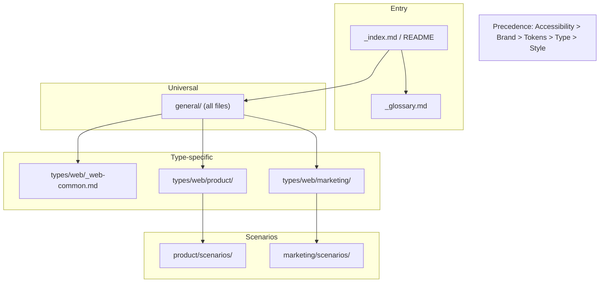

# Agent Rules Architecture and Content Optimisation Plan

This plan is based on a review of [kuat-docs/.tmp/agent-rules-meta-guide.md](kuat-docs/.tmp/agent-rules-meta-guide.md) against the current rules in [kuat-docs/rules/](kuat-docs/rules/). It identifies gaps and proposes changes to improve agent load behaviour, rule clarity, verifiability, and maintainability.

---

## Current State Summary

**Structure:** `rules/general/` (9 files, ~800 lines) + `rules/types/` (slides, photography, graphics, charts-data, web). Web has `marketing/` and `product/` with `scenarios/` and (product) `examples/` (react, vue, css). Entry points: [rules/README.md](kuat-docs/rules/README.md) and root [AGENTS.md](AGENTS.md).

**Strengths:** Clear general-vs-type separation, platform isolation, scenario structure (Principles, Layout, Design, Content, Accessibility, Implementation), "Related Documentation" sections, component decision tree, and AGENTS.md loading table.

**Gaps vs meta-guide:** No single entry with explicit rule hierarchy and conflict resolution; no glossary; rule files rarely use Intent/Rule/Verification/Exceptions; no "When generating / When reviewing"; no verification methods or formal review checklists; no version frontmatter; scenarios lack explicit "Load These Rules" blocks; no shared `_web-common`-style file; agent behaviour and audience context not codified in rules.

---

## 1. Entry Point and Navigation

**Goal:** One canonical entry that orients agents to structure, loading order, and conflict resolution.

- **Add `rules/_index.md**` (or rename/refactor [rules/README.md](kuat-docs/rules/README.md) to serve as the entry). Include:
  - **How to Use These Rules:** (1) Always load general (or foundations), (2) Load by output type from types/, (3) Load by scenario when applicable, (4) How to resolve conflicts.
  - **Rule hierarchy (precedence):** e.g. (1) Accessibility, (2) Brand non-negotiables, (3) Design language tokens, (4) Type-specific conventions, (5) Stylistic preferences. State explicitly that accessibility overrides aesthetics when they conflict.
- **Keep [AGENTS.md**](AGENTS.md) as the repo-root quick reference, but have it point to `rules/_index.md` (or the chosen entry) for full hierarchy and conflict resolution so there is a single source of truth.
- **Optional:** Use underscore naming for the entry file (`_index.md`) as in the meta-guide so it’s clearly the navigation entry; if the project prefers README for discoverability, keep README and ensure it contains the same hierarchy and conflict rules (or transcludes them).

**Files to create/update:** `kuat-docs/rules/_index.md` (new or replace README), `kuat-docs/rules/README.md`, `AGENTS.md`.

---

## 2. Glossary and Terminology

**Goal:** Shared definitions so agents (and humans) interpret terms consistently.

- **Add `rules/_glossary.md**` with short definitions for terms used across rules (e.g. "design token", "clear space", "WCAG AA", "semantic colour", "primary action", "Kuat Blocks", "shadcn"). Link to it from the entry point and from any rule that introduces or relies on these terms.
- **Reference in entry point:** "See `_glossary.md` for shared terminology."

**Files to create:** `kuat-docs/rules/_glossary.md`.

---

## 3. Rule Hierarchy and Naming (Light Touch)

**Goal:** Align naming and mental model with the meta-guide without a disruptive restructure.

- **Keep `general/` and `types/**` as the top-level split (no mandatory rename to foundations/design-language/media-types). The meta-guide’s hierarchy is conceptual; the current layout already separates “universal” vs “platform-specific” and is documented. Optionally add a one-line note in the entry that “general = foundations + design language” for agents that expect those terms.
- **Naming:** Meta-guide prefers singular nouns (e.g. `colour.md`). Current files use `colours.md`, `borders.md`. Optional renames: `colours.md` → `colour.md` (and update all cross-references). Defer other renames (e.g. borders) unless you do a broader rename pass.
- **Web shared content:** Meta-guide suggests a shared file for web (e.g. `_web-common.md`). Today [types/web/README.md](kuat-docs/rules/types/web/README.md) holds "Common Web Foundations" and "Technical Foundations". Either:
  - Extract that content into `types/web/_web-common.md` and keep README as a short index that points to it, or
  - Keep in README but add an explicit "Load this file for any web task" note and list what it covers (layout principles, nav patterns, colour tokens, CSS/component stack). Recommendation: extract to `_web-common.md` so agents can load “web common” once without pulling the full types tree.

**Files to create/update:** `kuat-docs/rules/_index.md` (or README), optional `rules/general/colour.md` (rename from colours.md + fix refs), `kuat-docs/rules/types/web/_web-common.md` (new, content from web README), [kuat-docs/rules/types/web/README.md](kuat-docs/rules/types/web/README.md).

---

## 4. Rule Anatomy (Intent, Rule, Verification, Exceptions)

**Goal:** Make individual rules machine- and human-verifiable and unambiguous.

- **Introduce the standard block where it adds most value:** For the most critical rules (e.g. primary button colour, contrast, heading hierarchy, logo clear space, “no colour alone”), add:
  - **Intent** (why the rule exists)
  - **Rule** (one clear imperative)
  - **Applies to** (scope)
  - **Examples:** ✓ correct, ✗ incorrect
  - **Verification** (automated / visual / functional / comparative)
  - **Exceptions** (or “None”)
- **Pilot in 2–3 files:** e.g. [general/accessibility.md](kuat-docs/rules/general/accessibility.md) (contrast, colour-not-alone, focus), [general/colours.md](kuat-docs/rules/general/colours.md) (primary token usage), [general/logo.md](kuat-docs/rules/general/logo.md) (clear space). Then roll the pattern to other high-impact rules.
- **Positive and negative constraints:** Ensure each major rule has both “Always” and “Never” (or “Do not”) where applicable; the meta-guide notes that negative constraints reduce drift.
- **Specificity:** Group by level (Principle vs Guideline vs Rule vs Specification) within a file where it helps (e.g. accessibility), to avoid mixing vague principles with exact specs in one bullet list.

**Files to update:** Start with `general/accessibility.md`, `general/colours.md`, `general/logo.md`; then extend to `general/typography.md`, `general/spacing.md`, and key sections in `types/web/product/accessibility.md` and `types/web/product/component-decision-tree.md`.

---

## 5. Dual-Purpose Rules (Generation and Review)

**Goal:** Support both “create something that follows this rule” and “check if this artifact complies”.

- **Add “When generating” / “When reviewing”** for rules that benefit from it (e.g. heading hierarchy, form labels, link styling, focus visibility). Example pattern:
  - **When generating:** e.g. “Start with one H1; use H2 for major sections; nest logically.”
  - **When reviewing:** e.g. “Count H1s (must be 1); check heading sequence; confirm H1 describes page purpose.”
- **Pilot in:** [general/accessibility.md](kuat-docs/rules/general/accessibility.md) (headings, links, focus, alt text) and one scenario (e.g. [types/web/product/scenarios/forms.md](kuat-docs/rules/types/web/product/scenarios/forms.md)) for form and validation rules.

**Files to update:** `general/accessibility.md`, selected product scenario files (e.g. forms, authentication).

---

## 6. Verification Methods and Review Checklists

**Goal:** Every rule points to how compliance can be checked; complex outputs have a checklist.

- **Verification per rule:** In the rule anatomy blocks (above), always fill **Verification** with one of: Automated (e.g. lint/audit), Visual inspection, Functional test, Comparative (vs reference). Where possible, name tools (e.g. Lighthouse, axe, contrast checker).
- **Structured checklists:** Add a “Review checklist” section to key documents:
  - **General:** Add a “General output review checklist” (accessibility, brand, tokens) to [rules/README.md](kuat-docs/rules/README.md) or `_index.md`, or to [general/accessibility.md](kuat-docs/rules/general/accessibility.md) and link from entry.
  - **Web product:** Add “Web page / product screen review checklist” (accessibility, brand, code quality) to [types/web/product/design.md](kuat-docs/rules/types/web/product/design.md) or to a dedicated `types/web/product/review-checklist.md`, linked from product README and scenarios.
  - **Scenarios:** Add a short “Scenario review checklist” at the end of each scenario file (e.g. forms, auth, dashboards, marketing pages) with 5–10 scenario-specific checks.

**Files to create/update:** `general/accessibility.md`, `types/web/product/design.md` or new `review-checklist.md`, each scenario file in `types/web/product/scenarios/` and `types/web/marketing/scenarios/`.

---

## 7. Cross-References and Precedence

**Goal:** Explicit “See X for Y” and “If conflict, X wins” so agents don’t infer.

- **Explicit See: pattern:** Where a rule depends on another, add a line like: “See: `general/accessibility.md#colour-contrast` for contrast requirements.” Use relative paths and anchors. Apply in colour, typography, logo, and any type-specific file that defers to general rules.
- **Conflict resolution:** In the entry point (and optionally in [general/accessibility.md](kuat-docs/rules/general/accessibility.md)), state: “When rules conflict, accessibility requirements take precedence over aesthetic or convenience rules unless explicitly stated otherwise.”
- **Scenario “Load These Rules”:** At the top of each scenario file, add a **Load These Rules** (or **Prerequisites**) block listing exact files, e.g.:
  - `general/accessibility.md`, `general/colours.md`, `general/typography.md`, `general/content.md`
  - `types/web/_web-common.md` (if created), `types/web/product/design.md`, `types/web/product/accessibility.md`
  - Plus the scenario file itself.  
  This matches the meta-guide’s scenario pattern and makes context loading deterministic.

**Files to update:** Entry point, `general/colours.md`, `general/typography.md`, `general/logo.md`, `general/accessibility.md`, all scenario files in product and marketing.

---

## 8. Agent Behaviour and Context

**Goal:** Codify how agents should use the rules and what audience/standards apply.

- **Agent behaviour preamble:** Add a short **Agent behaviour** (or **Behaviour when using these rules**) section to the entry point or to a single “meta” file that agents load first. Include: search before creating; verify outputs against rules; cite rules when explaining decisions; flag conflicts and state precedence; ask when ambiguous; state when a request is out of scope. Optionally mirror or link this in [AGENTS.md](AGENTS.md).
- **Audience context:** Add an **Audience context** (or **Output audience**) section (entry point or general README): who the outputs are for (internal / client / public) and how that affects polish vs speed vs accessibility. Keeps rules consistent with the meta-guide’s “consider audience” guidance.
- **Reference standards:** Add a **Reference standards** section (e.g. in entry or [general/accessibility.md](kuat-docs/rules/general/accessibility.md)): WCAG 2.2 AA, any contrast method (e.g. APCA if adopted), and internal brand doc version. State that external standards take precedence unless otherwise stated.

**Files to update:** `rules/_index.md` (or README), optionally `AGENTS.md`, `general/accessibility.md` or `general/README.md`.

---

## 9. Scenarios: Structure and Consistency

**Goal:** Scenarios as the main “cross-cutting” layer with explicit load list and review checklist.

- **Standardise scenario header:** Each scenario file starts with: **Context** (1–2 sentences), **Load These Rules** (bullet list of paths), then **Scenario-specific guidance** (Principles, Layout, Design, Content, Accessibility, Implementation, Best Practices). End with **Review checklist for [scenario name]** (checkboxes).
- **Reduce duplication:** Where scenarios repeat the same UX principles or layout theory, reference the design or accessibility docs instead of copying; keep scenario content focused on “what’s different for this page type.”
- **Apply to all scenario files:** [types/web/product/scenarios/](kuat-docs/rules/types/web/product/scenarios/) (authentication, dashboards, documentation, forms) and [types/web/marketing/scenarios/marketing-pages.md](kuat-docs/rules/types/web/marketing/scenarios/marketing-pages.md).

**Files to update:** All files in `types/web/product/scenarios/`, `types/web/marketing/scenarios/marketing-pages.md`; optionally add a one-page “Scenario authoring” note in `types/web/product/scenarios/README.md` or `types/web/marketing/scenarios/README.md`.

---

## 10. Examples and Code Samples

**Goal:** Examples that clearly show correct vs incorrect and tie to rules.

- **Good vs bad:** Ensure example sections use “✓ Good” / “✗ Poor” (or equivalent) with a one-line explanation of why. Many files in [types/web/product/examples/](kuat-docs/rules/types/web/product/examples/) already have “Good vs Bad”; audit for missing or vague explanations and add the **rule** they demonstrate.
- **Link examples to rules:** In example files, add a line like “See: `general/colours.md` for token usage” or “See: `product/component-decision-tree.md` for when to use this component” so agents can trace back to the rule.

**Files to update:** Selected example files in `types/web/product/examples/react/`, `vue/`, `css/` (e.g. colours, components, borders).

---

## 11. Maintenance and Evolution

**Goal:** Versioning, deprecation, and extension without breaking existing consumers.

- **Frontmatter:** Add optional YAML frontmatter to key rule files: `version`, `last-updated`, and short `changelog` (e.g. “2.1.0: Added dark mode tokens”). Start with entry point and general files; extend to type-specific if useful.
- **Deprecation pattern:** When a rule or pattern is retired, add a **Deprecated** section with: status, old pattern, new pattern, migration (search/replace or pointer to mapping). Document in changelog.
- **Extension points:** In the entry point (or a short “Extending these rules” doc), state: projects may add a `project-rules/` (or similar); they must reference the base rules and document exceptions; they must not override foundation rules (accessibility, brand non-negotiables). Optionally add an example project extension snippet.

**Files to create/update:** Entry point, new optional `rules/EXTENDING.md` or section in README; add frontmatter to 2–3 pilot files (e.g. `general/colours.md`, `general/accessibility.md`).

---

## 12. Anti-Patterns and Validation

**Goal:** Avoid vague or unverifiable language; keep files focused.

- **Audit and fix anti-patterns:** Search for phrases like “use good judgement”, “should generally”, “consider using”, “etc.” and replace with specific criteria, clear scope, or “Use X when Y” / “Never use X”. Replace open-ended lists with explicit lists or a defined category.
- **Cognitive load:** Keep files under ~~500 lines; max 5–7 major sections and ~3 heading levels per file. Current large files: [general/accessibility.md](kuat-docs/rules/general/accessibility.md) (~~425), [types/web/product/technical.md](kuat-docs/rules/types/web/product/technical.md) (~458). If they grow, split (e.g. accessibility: one file for principles/visual, one for technical/ARIA; technical: split by “setup” vs “theming” vs “troubleshooting”).
- **Validation checklist:** Add a short “Rule authoring checklist” (clarity, completeness, verifiability, maintainability) to the meta-guide or to a CONTRIBUTING.md in the repo so new/updated rules are reviewed against it.

**Files to update:** Various rule files after grep for anti-patterns; optionally add `kuat-docs/CONTRIBUTING.md` or a “Writing rules” section in README.

---

## 13. Implementation Order and Priorities

Recommended order to maximise impact without big-bang change:

| Phase | Focus                          | Deliverables                                                                                                                   |
| ----- | ------------------------------ | ------------------------------------------------------------------------------------------------------------------------------ |
| **1** | Entry and hierarchy            | `_index.md` (or README) with How to Use, Rule hierarchy, conflict resolution; align AGENTS.md.                                 |
| **2** | Glossary and web common        | `_glossary.md`; optionally `types/web/_web-common.md` and trim web README.                                                     |
| **3** | Rule anatomy and verification  | Pilot Intent/Rule/Verification/Exceptions in accessibility, colours, logo; add verification methods and 1–2 review checklists. |
| **4** | Scenarios                      | “Load These Rules” and “Review checklist” in every scenario file; standardise header.                                          |
| **5** | Cross-references and behaviour | “See: path#anchor” in key general files; Agent behaviour and Reference standards in entry.                                     |
| **6** | Dual-purpose and examples      | “When generating / When reviewing” in accessibility and one scenario; tighten Good vs Bad in examples.                         |
| **7** | Maintenance and polish         | Frontmatter on pilot files; EXTENDING.md or README section; anti-pattern pass; file splits if needed.                          |

---

## Diagram: Rule Loading and Precedence

---

## Risks and Mitigations

- **Rename side effects:** Renaming `colours.md` → `colour.md` breaks existing links and agent prompts. Mitigation: do renames in one commit, update all refs (and AGENTS.md/setup docs); or skip renames and only document “conceptually: design-language”.
- **Scope creep:** Rule anatomy and checklists can grow. Mitigation: pilot in 2–3 files; use templates; phase rollout.
- **Duplicate content:** Splitting files or adding checklists might duplicate text. Mitigation: “See: path” and short checklist items that reference sections rather than restating them.

---

## Summary

Optimising the agent rules will involve: (1) a single entry point with explicit hierarchy and conflict resolution, (2) a glossary and optional web-common file, (3) standard rule anatomy and verification in key files, (4) dual-purpose and review checklists where they add value, (5) explicit cross-references and “Load These Rules” in scenarios, (6) agent behaviour and reference standards, (7) versioning and extension guidance, and (8) anti-pattern cleanup and file size control. Implementing in the seven phases above will align the repo with the meta-guide while preserving the current general/types and web product/marketing structure.