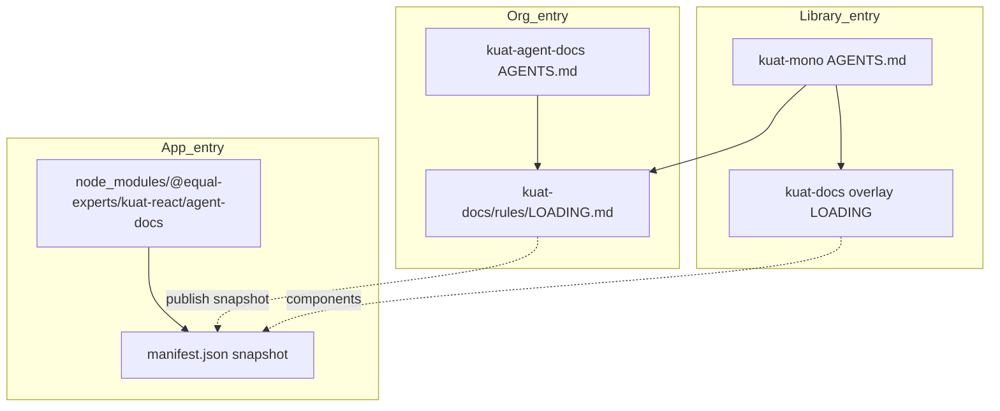

# Rules consumption architecture

How Equal Experts agent rules are structured, where to enter them, and how upstream, overlay, and npm package sources combine.

---

## Three entry points

| Entry | Who | Start here | Rules source |
|-------|-----|------------|--------------|
| **Org** | Brand, slides, marketing, cross-platform | [AGENTS.md](../../AGENTS.md) → [LOADING.md](../rules/LOADING.md) | Git clone of `kuat-agent-docs` |
| **Library** | Kuat maintainers, component authors | `kuat-mono` `AGENTS.md` → mono `kuat-docs/LOADING.md` | Git upstream + `KUAT_RULES_OVERLAY_PATH` |
| **App** | Product engineers using Kuat in an application | `node_modules/@equal-experts/kuat-react/agent-docs/AGENTS.md` | Bundled snapshot in installed package |

---

## Load order

1. Run [ensure-rules.sh](../../skills/scripts/ensure-rules.sh) (or follow [resolve-rules.md](../../skills/shared/resolve-rules.md)).
2. Load `{RULES_DIR}/LOADING.md` (or `LOADING-consumer.md` for npm entry).
3. Load foundations → role card → type-specific rules per task.
4. **If overlay set:** load `KUAT_RULES_OVERLAY_PATH` files second (component docs, contributor workflow).
5. **If component IDs cited:** resolve via `components.manifest.json` → `components/{slug}.md`.

See [consumption-contract.md](../../skills/shared/consumption-contract.md) for conflict policy.

---

## Rule resolution order

`ensure-rules.sh` and agents try paths in this order:

1. `KUAT_RULES_PATH` — explicit override (full upstream git)
2. `.kuat-rules-path` — one line in project root pointing at rules repo
3. **npm package** — walk up from cwd: `node_modules/@equal-experts/kuat-react/agent-docs/rules/LOADING-consumer.md`, then `kuat-vue`
4. Sibling paths: `kuat-agent-docs`, `vendor/kuat-agent-docs`, `../kuat-agent-docs`
5. Skills co-located with rules repo

Emitted variables:

| Variable | Meaning |
|----------|---------|
| `RULES_ROOT` | Root containing agent rules |
| `RULES_DIR` | `{RULES_ROOT}/kuat-docs/rules` or package `agent-docs/rules` |
| `RULES_REF` | Git SHA or `manifest.json` `rulesSnapshotRef` |
| `RULES_SOURCE` | `git` or `package` |
| `OVERLAY_DIR` | Set when `KUAT_RULES_OVERLAY_PATH` is valid |
| `PACKAGE_VERSION` | From package `manifest.json` when `RULES_SOURCE=package` |

---

## Component IDs

Stable IDs link upstream scenarios to downstream component guides.

| Pattern | Example | Doc location |
|---------|---------|--------------|
| `kuat:{name}` | `kuat:button-group` | Package or overlay `components/button-group.md` |
| `shadcn:{name}` | `shadcn:button` | `components/button.md` (EE-themed usage) |
| `kuat:kuat-{block}` | `kuat:kuat-header` | `components/kuat-header.md` |

Registry: [component-registry.md](../rules/types/web/product/component-registry.md).

Resolve: read `agent-docs/components.manifest.json` (or overlay equivalent) → load `components/{slug}.md`.

---

## Bundled rules in npm packages

`@equal-experts/kuat-react` and `@equal-experts/kuat-vue` ship an `agent-docs/` directory built on release:

- **Snapshot** of upstream: `foundations/`, `types/web/product/`, `types/web/marketing/`, `roles/brand-reviewer.md`
- **Merged** from mono: `components/` + `components.manifest.json`
- **Generated:** `manifest.json`, `LOADING-consumer.md`, consumer `AGENTS.md`

Rules version is pinned to the package version. Cite in reviews: `@equal-experts/kuat-react@x.y.z (rules snapshot abc123…)`.

**Override:** set `KUAT_RULES_PATH` to a git clone when you need slides, full taxonomy, or latest upstream before the next package release.

---

## Environment variables

| Variable | Use |
|----------|-----|
| `KUAT_RULES_PATH` | Force upstream git root |
| `KUAT_RULES_OVERLAY_PATH` | Mono or project overlay (`kuat-docs` with component guides) |
| `KUAT_RULES_REF` | Pin git checkout |
| `KUAT_RULES_UPDATE=1` | Allow pull/checkout when pinned |

---

## Documentation map

| Audience | Document |
|----------|----------|
| Rules structure | [rules/README.md](../rules/README.md) |
| Task → files | [LOADING.md](../rules/LOADING.md) |
| Web product | [types/web/product/README.md](../rules/types/web/product/README.md) |
| Ownership | [ownership-matrix.md](./ownership-matrix.md) |
| Skills install | [skills/INSTALL.md](../../skills/INSTALL.md) |
| Mono implementation | [kuat-mono-implementation-plan.md](./kuat-mono-implementation-plan.md) |
| IDE snippet | [integration.md](./integration.md) |

---

## Related

- [ownership-matrix.md](./ownership-matrix.md)
- [skills/shared/resolve-rules.md](../../skills/shared/resolve-rules.md)
- [skills/shared/consumption-contract.md](../../skills/shared/consumption-contract.md)
